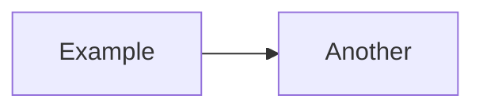

**Onya Mermaid Demo**

This directory contains demo scripts showing how to use the Onya Mermaid emitter. Mermaid is a text-based diagramming convention with a simple, plain text syntax, designed to work with Markdown, for representing technical diagrams.

# Running the demo

From the repository root, make sure Onya is installed, then run:

```bash
python mermaid_demo.py
```

This generates several Mermaid markup files (Mermaid flowchart syntax):

1. **demo_basic.mmd** - Basic graph with nodes, properties, and relationships
2. **demo_styled.mmd** - Uses simple type→shape mapping (via `node_shapes`)
3. **demo_reified.mmd** - Reified relationships (edges with properties/metadata)
4. **demo_minimal.mmd** - Minimal structure-only view (no properties/types displayed)
5. **demo_literate.mmd** - Parse an Onya Literate document and export to Mermaid

# Viewing the output

You can paste any `.mmd` file into [Mermaid Live Editor](https://mermaid.live/), or embed the content as a Mermaid code fence in a Markdown editor/viewer that supports it, including by GitHub and many documentation tools:

````markdown

````

# Using in your code

```python
from onya.graph import graph
from onya.serial import mermaid

g = graph()
alice = g.node('http://example.org/Alice', 'http://schema.org/Person')
bob = g.node('http://example.org/Bob', 'http://schema.org/Person')
alice.add_edge('http://schema.org/knows', bob)

with open('output.mmd', 'w', encoding='utf-8') as f:
    mermaid.write(g, out=f,
                 base='http://example.org/',
                 propertybase='http://schema.org/',
                 rankdir='LR',
                 show_properties=True,
                 show_edge_annotations=True)
```

# Configuration options

`mermaid.write()` supports the same “core” knobs as the Graphviz emitter:

- `base`: base IRI for abbreviating node display labels
- `propertybase`: base IRI for abbreviating property/edge labels
- `rankdir`: layout direction (`TB`, `LR`, `BT`, `RL`)
- `show_properties` / `show_types`
- `show_edge_labels` / `show_edge_annotations`
- `node_shapes`: dict mapping type IRI → shape name (`box`, `round`, `circle`, `diamond`)

See `pylib/serial/mermaid.py` for details.
